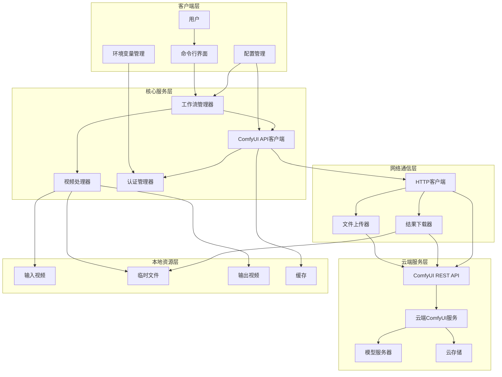
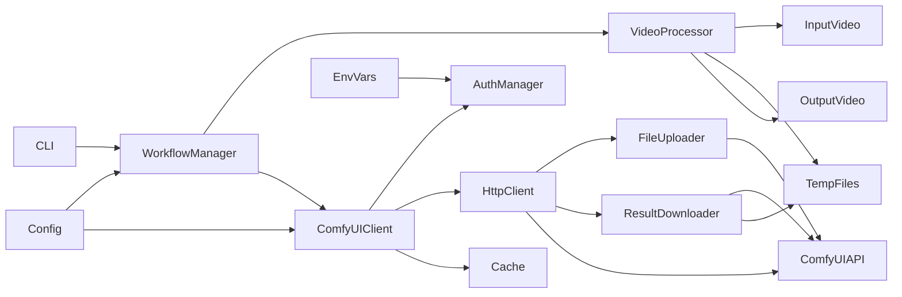
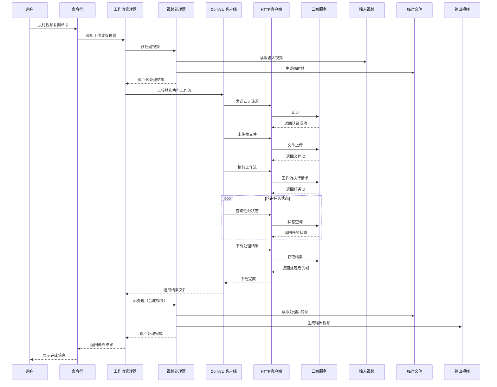

# 视频复刻项目 - 架构设计文档（云端ComfyUI版本）

## 1. 整体架构图



## 2. 分层设计和核心组件

### 2.1 客户端层
- **命令行界面(CLI)**：提供用户交互接口，接收命令和参数
- **配置管理**：管理应用配置，包括API端点、工作流参数等
- **环境变量管理**：管理敏感信息如API密钥、认证信息

### 2.2 核心服务层
- **工作流管理器**：协调整个处理流程，管理任务状态和进度
- **视频处理器**：负责视频预处理（分帧、格式转换）和后处理（合成）
- **ComfyUI API客户端**：封装与云端ComfyUI服务的通信逻辑
- **认证管理器**：处理API认证和会话管理

### 2.3 网络通信层
- **HTTP客户端**：处理HTTP请求和响应
- **文件上传器**：处理大文件分块上传逻辑
- **结果下载器**：处理异步结果轮询和下载

### 2.4 云端服务层
- **云端ComfyUI服务**：提供ComfyUI功能的云服务
- **ComfyUI REST API**：服务端API接口
- **模型服务器**：运行AI模型的服务器
- **云存储**：存储中间文件和结果

### 2.5 本地资源层
- **输入视频**：待处理的源视频文件
- **临时文件**：处理过程中的中间文件
- **输出视频**：最终生成的视频结果
- **缓存**：缓存API响应和临时数据

## 3. 模块依赖关系图



## 4. 接口契约定义

### 4.1 工作流管理器接口
```python
class WorkflowManager:
    def __init__(self, config: dict, comfyui_client: 'ComfyUIClient'):
        """初始化工作流管理器"""
        pass
    
    def execute_workflow(self, input_video_path: str, output_path: str, workflow_id: str) -> dict:
        """执行视频复刻工作流
        
        Args:
            input_video_path: 输入视频路径
            output_path: 输出视频路径
            workflow_id: 云端工作流ID
            
        Returns:
            包含处理结果信息的字典
        """
        pass
    
    def get_status(self, task_id: str) -> dict:
        """获取任务状态
        
        Args:
            task_id: 任务ID
            
        Returns:
            任务状态信息
        """
        pass
    
    def cancel_task(self, task_id: str) -> bool:
        """取消任务
        
        Args:
            task_id: 任务ID
            
        Returns:
            是否取消成功
        """
        pass
```

### 4.2 视频处理器接口
```python
class VideoProcessor:
    def extract_frames(self, video_path: str, output_dir: str, fps: int = None) -> list:
        """从视频中提取帧
        
        Args:
            video_path: 视频路径
            output_dir: 输出目录
            fps: 提取帧率，None表示使用原始帧率
            
        Returns:
            提取的帧文件路径列表
        """
        pass
    
    def create_video(self, frames_dir: str, output_path: str, fps: int, codec: str = 'mp4v') -> str:
        """将帧序列合成为视频
        
        Args:
            frames_dir: 帧目录
            output_path: 输出视频路径
            fps: 帧率
            codec: 编码器
            
        Returns:
            生成的视频路径
        """
        pass
    
    def get_video_info(self, video_path: str) -> dict:
        """获取视频信息
        
        Args:
            video_path: 视频路径
            
        Returns:
            视频信息字典（分辨率、帧率、时长等）
        """
        pass
    
    def preprocess_video(self, video_path: str, output_dir: str, max_resolution: tuple = None) -> dict:
        """视频预处理
        
        Args:
            video_path: 视频路径
            output_dir: 输出目录
            max_resolution: 最大分辨率限制
            
        Returns:
            预处理结果信息
        """
        pass
```

### 4.3 ComfyUI API客户端接口
```python
class ComfyUIClient:
    def __init__(self, api_endpoint: str, auth_manager: 'AuthManager'):
        """初始化ComfyUI API客户端
        
        Args:
            api_endpoint: API端点URL
            auth_manager: 认证管理器
        """
        pass
    
    def upload_file(self, file_path: str, file_type: str) -> str:
        """上传文件到云端
        
        Args:
            file_path: 本地文件路径
            file_type: 文件类型
            
        Returns:
            云端文件ID
        """
        pass
    
    def create_workflow(self, workflow_data: dict) -> str:
        """创建工作流
        
        Args:
            workflow_data: 工作流配置数据
            
        Returns:
            工作流ID
        """
        pass
    
    def execute_workflow(self, workflow_id: str, inputs: dict) -> str:
        """执行工作流
        
        Args:
            workflow_id: 工作流ID
            inputs: 输入参数
            
        Returns:
            任务ID
        """
        pass
    
    def get_task_status(self, task_id: str) -> dict:
        """获取任务状态
        
        Args:
            task_id: 任务ID
            
        Returns:
            任务状态信息
        """
        pass
    
    def download_result(self, result_id: str, output_path: str) -> str:
        """下载处理结果
        
        Args:
            result_id: 结果ID
            output_path: 本地输出路径
            
        Returns:
            下载的文件路径
        """
        pass
```

### 4.4 认证管理器接口
```python
class AuthManager:
    def __init__(self, api_key: str, auth_url: str = None):
        """初始化认证管理器
        
        Args:
            api_key: API密钥
            auth_url: 认证URL（如果需要OAuth等）
        """
        pass
    
    def get_auth_headers(self) -> dict:
        """获取认证头
        
        Returns:
            包含认证信息的HTTP头字典
        """
        pass
    
    def refresh_token(self) -> bool:
        """刷新认证令牌（如果支持）
        
        Returns:
            是否刷新成功
        """
        pass
    
    def is_authenticated(self) -> bool:
        """检查是否已认证
        
        Returns:
            是否已认证
        """
        pass
```

## 5. 数据流向图



## 6. 异常处理策略

### 6.1 错误类型
- **配置错误**：API密钥缺失、配置格式错误
- **网络错误**：连接失败、超时、断开连接
- **API错误**：认证失败、参数错误、服务端错误
- **视频处理错误**：文件格式不支持、文件损坏
- **资源错误**：磁盘空间不足、内存不足

### 6.2 错误处理机制
- **重试机制**：对网络错误实现指数退避重试
- **断点续传**：支持大文件上传断点续传
- **错误日志**：详细记录所有错误，包括上下文信息
- **优雅降级**：在某些功能不可用时提供替代方案
- **用户通知**：清晰的错误消息和恢复建议

## 7. 技术实现细节

### 7.1 目录结构
```
video_keev/
├── src/
│   ├── __init__.py
│   ├── main.py            # 主入口
│   ├── config/
│   │   ├── __init__.py
│   │   └── manager.py     # 配置管理
│   ├── workflow/
│   │   ├── __init__.py
│   │   └── manager.py     # 工作流管理
│   ├── video/
│   │   ├── __init__.py
│   │   └── processor.py   # 视频处理
│   ├── api/
│   │   ├── __init__.py
│   │   ├── client.py      # API客户端
│   │   ├── auth.py        # 认证管理
│   │   └── http.py        # HTTP通信
│   └── utils/
│       ├── __init__.py
│       ├── logger.py      # 日志工具
│       └── file_utils.py  # 文件工具
├── configs/
│   └── default.yaml       # 默认配置
├── outputs/               # 输出目录
├── .env.example           # 环境变量示例
├── requirements.txt       # 依赖清单
└── README.md              # 项目说明
```

### 7.2 关键技术选型
- **Python 3.8+**：主要开发语言
- **requests**：HTTP客户端库
- **opencv-python**：视频处理
- **PyYAML**：配置文件解析
- **python-dotenv**：环境变量管理
- **tqdm**：进度显示
- **logging**：日志管理

### 7.3 配置文件示例（YAML格式）
```yaml
# ComfyUI 云端服务配置
comfyui:
  api_endpoint: "https://api.comfyui-cloud.example/v1"
  timeout: 300  # 秒
  retry_count: 5
  retry_delay: 5  # 秒
  upload_chunk_size: 5242880  # 5MB

# 视频处理配置
video:
  default_fps: 30
  max_resolution:
    width: 1920
    height: 1080
  temp_dir: "./temp"
  output_dir: "./outputs"

# 工作流配置
workflows:
  default:
    id: "default_video_replication"
    params:
      model_id: "realistic_video_v1"
      quality_level: "high"

# 日志配置
logging:
  level: "INFO"
  file: "video_keev.log"
```

### 7.4 安全性考虑
- API密钥通过环境变量管理，不硬编码
- 支持HTTPS加密通信
- 临时文件处理后安全删除
- 错误信息不泄露敏感数据

### 7.5 扩展性设计
- 插件系统支持自定义处理器
- 配置驱动的API参数管理
- 模块化设计便于功能扩展
- 支持多后端适配（不同的ComfyUI云服务）