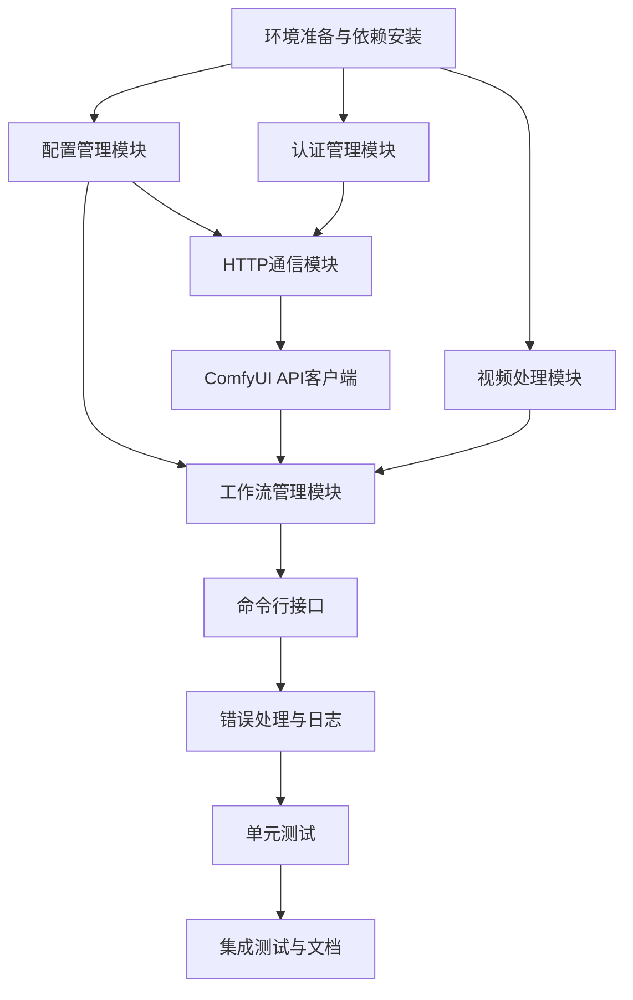

# 视频复刻项目 - 任务拆分文档（云端ComfyUI版本）

## 1. 任务依赖图

## 2. 任务拆分详情

### 任务1: 环境准备与依赖安装

#### 输入契约
- Python 3.8+环境
- 互联网连接（用于安装依赖）

#### 输出契约
- 项目依赖清单(requirements.txt)
- 环境变量示例文件(.env.example)
- 项目基础目录结构

#### 实现约束
- 所有依赖需明确版本号
- 遵循Python最佳实践
- 考虑跨平台兼容性

#### 依赖关系
- 前置任务：无
- 后置任务：任务2、任务3、任务6

#### 验收标准
- requirements.txt文件存在且格式正确
- 环境变量示例文件存在且包含必要配置项
- 基本目录结构创建完成

### 任务2: 配置管理模块

#### 输入契约
- 配置文件格式定义
- 环境变量管理方式

#### 输出契约
- 配置管理类实现
- YAML配置文件解析功能
- 配置验证功能

#### 实现约束
- 使用PyYAML库
- 支持默认配置和用户配置合并
- 配置项类型验证

#### 依赖关系
- 前置任务：任务1
- 后置任务：任务4、任务7

#### 验收标准
- 成功加载和解析配置文件
- 配置项类型验证正确
- 环境变量覆盖机制正常工作

### 任务3: 认证管理模块

#### 输入契约
- API认证方式（API Key或OAuth）
- 环境变量中的认证信息

#### 输出契约
- 认证管理器类实现
- 认证头生成功能
- 认证状态检查功能
- 令牌刷新功能（如果需要）

#### 实现约束
- 安全处理API密钥
- 支持HTTPS通信
- 避免在日志中泄露认证信息

#### 依赖关系
- 前置任务：任务1
- 后置任务：任务4

#### 验收标准
- 成功从环境变量加载API密钥
- 正确生成认证HTTP头
- 认证状态检查正常工作

### 任务4: HTTP通信模块

#### 输入契约
- API端点URL
- 请求超时设置
- 重试策略配置

#### 输出契约
- HTTP客户端实现
- 请求构建和响应解析功能
- 超时和重试处理
- 错误响应处理

#### 实现约束
- 使用requests库
- 实现指数退避重试
- 支持HTTP/HTTPS协议
- 资源使用效率（连接池）

#### 依赖关系
- 前置任务：任务2、任务3
- 后置任务：任务5

#### 验收标准
- 成功发送HTTP请求
- 正确处理各种HTTP状态码
- 重试机制在网络错误时正常工作
- 连接超时处理正常

### 任务5: ComfyUI API客户端

#### 输入契约
- ComfyUI REST API规范
- 文件上传/下载机制
- 任务状态查询机制

#### 输出契约
- ComfyUI API客户端类实现
- 文件上传功能（支持大文件）
- 工作流执行功能
- 任务状态查询功能
- 结果下载功能

#### 实现约束
- 遵循RESTful API设计原则
- 支持异步任务处理模式
- 实现断点续传
- 合理的缓存策略

#### 依赖关系
- 前置任务：任务4
- 后置任务：任务7

#### 验收标准
- 成功上传文件到云端
- 正确执行云端工作流
- 成功查询任务状态
- 正确下载处理结果

### 任务6: 视频处理模块

#### 输入契约
- 输入视频文件
- 视频处理参数（分辨率、帧率等）

#### 输出契约
- 视频处理器类实现
- 视频帧提取功能
- 帧合成视频功能
- 视频信息获取功能
- 视频预处理功能

#### 实现约束
- 使用opencv-python库
- 支持常见视频格式
- 处理过程中合理使用临时文件
- 资源管理（内存、CPU使用）

#### 依赖关系
- 前置任务：任务1
- 后置任务：任务7

#### 验收标准
- 成功从视频中提取帧
- 正确将帧序列合成为视频
- 准确获取视频元信息
- 视频预处理（缩放、格式转换）正常工作

### 任务7: 工作流管理模块

#### 输入契约
- 配置信息
- ComfyUI API客户端
- 视频处理器

#### 输出契约
- 工作流管理器类实现
- 完整工作流执行功能
- 任务状态管理
- 任务取消功能

#### 实现约束
- 协调各模块间的交互
- 错误传播和处理
- 状态持久化（可选）
- 进度跟踪

#### 依赖关系
- 前置任务：任务2、任务5、任务6
- 后置任务：任务8

#### 验收标准
- 完整工作流执行成功
- 正确管理任务状态
- 任务取消功能正常工作
- 进度报告准确

### 任务8: 命令行接口

#### 输入契约
- 工作流管理器
- 用户参数规范

#### 输出契约
- 命令行接口实现
- 参数解析和验证
- 帮助信息
- 进度显示

#### 实现约束
- 使用argparse或click库
- 清晰的命令格式和帮助信息
- 友好的用户反馈
- 支持批处理模式

#### 依赖关系
- 前置任务：任务7
- 后置任务：任务9

#### 验收标准
- 命令行参数正确解析
- 帮助信息完整清晰
- 进度显示正常
- 用户输入错误时提供有用提示

### 任务9: 错误处理与日志

#### 输入契约
- 应用程序各模块
- 日志配置

#### 输出契约
- 日志系统实现
- 异常处理机制
- 错误信息格式化
- 用户友好的错误提示

#### 实现约束
- 使用Python标准logging模块
- 支持不同日志级别
- 日志文件轮转
- 避免敏感信息泄露

#### 依赖关系
- 前置任务：任务8
- 后置任务：任务10

#### 验收标准
- 日志记录完整准确
- 异常处理优雅
- 错误信息对用户友好且有用
- 敏感信息不泄露到日志

### 任务10: 单元测试

#### 输入契约
- 所有实现的模块
- 测试数据

#### 输出契约
- 单元测试套件
- 测试覆盖率报告
- 测试数据

#### 实现约束
- 使用unittest或pytest框架
- 模拟外部依赖（API调用、文件操作）
- 测试边界条件和异常情况
- 测试覆盖率≥80%

#### 依赖关系
- 前置任务：任务9
- 后置任务：任务11

#### 验收标准
- 所有测试通过
- 测试覆盖率达到要求
- 包含必要的边界条件测试
- 模拟外部依赖正确

### 任务11: 集成测试与文档

#### 输入契约
- 完整的应用程序
- API文档

#### 输出契约
- 集成测试套件
- 用户手册
- API文档
- 示例脚本

#### 实现约束
- 端到端测试场景
- 文档与代码同步
- 清晰的安装和使用说明
- 示例涵盖常见用例

#### 依赖关系
- 前置任务：任务10
- 后置任务：无

#### 验收标准
- 集成测试通过
- 文档完整准确
- 示例脚本可运行
- 用户手册易于理解

## 3. 任务执行顺序

1. **环境准备与依赖安装** (T1)
2. **配置管理模块** (T2)
3. **认证管理模块** (T3)
4. **HTTP通信模块** (T4)
5. **ComfyUI API客户端** (T5)
6. **视频处理模块** (T6)
7. **工作流管理模块** (T7)
8. **命令行接口** (T8)
9. **错误处理与日志** (T9)
10. **单元测试** (T10)
11. **集成测试与文档** (T11)

## 4. 风险评估

### 4.1 技术风险

| 风险项 | 影响程度 | 可能性 | 缓解措施 |
|-------|---------|--------|----------|
| API认证失败 | 高 | 中 | 实现健壮的认证错误处理和重试机制 |
| 网络连接不稳定 | 高 | 中 | 实现断点续传和重试策略 |
| 文件大小限制 | 中 | 中 | 实现分块处理和压缩优化 |
| 云端服务限流 | 中 | 高 | 实现请求队列和速率限制控制 |
| 视频格式兼容性 | 中 | 中 | 支持多种常见视频格式，提供转换工具 |

### 4.2 资源风险

| 风险项 | 影响程度 | 可能性 | 缓解措施 |
|-------|---------|--------|----------|
| 临时文件占用空间大 | 中 | 高 | 及时清理临时文件，实现文件大小监控 |
| 内存使用过高 | 高 | 中 | 优化内存使用，实现分块处理 |
| 网络带宽限制 | 中 | 高 | 实现断点续传，支持低带宽模式 |

### 4.3 依赖风险

| 风险项 | 影响程度 | 可能性 | 缓解措施 |
|-------|---------|--------|----------|
| 第三方库版本冲突 | 高 | 中 | 明确版本锁定，使用虚拟环境 |
| 云端API变更 | 高 | 中 | 实现API适配器模式，支持多版本兼容 |
| 外部服务不可用 | 高 | 低 | 监控服务健康状态，提供优雅降级方案 |

## 5. 质量保证

### 5.1 代码规范
- 遵循PEP 8编码规范
- 使用类型提示
- 编写清晰的文档字符串
- 函数和类命名规范一致

### 5.2 测试策略
- 单元测试覆盖核心功能
- 集成测试验证模块间交互
- 端到端测试验证完整工作流
- 性能测试验证处理速度

### 5.3 文档要求
- 每个模块提供详细文档
- API文档描述所有公共接口
- 用户手册包含安装、配置和使用说明
- 示例代码演示常见用例

### 5.4 版本控制
- 语义化版本控制
- 清晰的版本变更日志
- 向后兼容性考虑
- 定期发布新版本